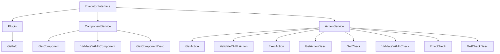

# Executor Plugin Interface Documentation

## Version: 1.0.0

### Overview

The `Executor` interface is an extensible framework enabling seamless integration of plugins into a host application. It encapsulates key operations such as executing actions, performing validation checks, and managing configurations. This design ensures modularity, ease of maintenance, and scalability.

### Core Features
- **Modular Design**: Plugins can be implemented for diverse functionalities without altering the core system.
- **Validation Mechanisms**: Supports robust YAML validation for enhanced reliability.
- **Scalability**: Simplifies the addition of new plugins or extension of existing ones.
- **Enhanced Debugging**: Human-readable descriptions aid in efficient troubleshooting and logging.

---

### Architecture

#### Plugin Interface
```go
// Plugin defines the interface for registering
// and retrieving plugin information.
type Plugin interface {
    GetInfo() (PluginInfo, error)
}
```
- **Purpose**: Facilitates the retrieval of essential metadata about the plugin.
- **Method**: 
  - `GetInfo`: Returns details like name, version, and description of the plugin.

#### ComponentService Interface
```go
// ComponentService defines methods for handling components within the plugin.
type ComponentService interface {
    GetComponent(data map[string]interface{}) (Component, error)
    ValidateYAMLComponent(component Component) error
    GetComponentDesc(ctx context.Context, component Component) string
}
```
- **Purpose**: Manages the configuration and resources required by plugins.
- **Methods**:
  - `GetComponent`: Constructs a structured component from input data.
  - `ValidateYAMLComponent`: Ensures that the component adheres to defined constraints.
  - `GetComponentDesc`: Provides descriptive information about the component.

#### ActionService Interface
```go
// ActionService defines methods for handling actions within the plugin.
type ActionService interface {
    GetAction(data map[string]interface{}) (Action, error)
    ValidateYAMLAction(ctx context.Context, action Action) error
    ExecAction(ctx context.Context, component Component, action Action) error
    GetActionDesc(ctx context.Context, action Action) string
    GetCheck(data map[string]interface{}) (Check, error)
    ValidateYAMLCheck(ctx context.Context, check Check) error
    ExecCheck(ctx context.Context, component Component, check Check) (bool, error)
    GetCheckDesc(ctx context.Context, action Action) string
}
```
- **Purpose**: Orchestrates the creation, validation, and execution of actions and checks.
- **Methods**:
  - `GetAction`, `GetCheck`: Generate structured representations of actions or checks from raw input.
  - `ValidateYAMLAction`, `ValidateYAMLCheck`: Validate actions and checks against predefined criteria.
  - `ExecAction`, `ExecCheck`: Execute the specified action or perform a check, returning results or errors as appropriate.
  - `GetActionDesc`, `GetCheckDesc`: Generate human-readable summaries to facilitate debugging and logging.

#### Executor Interface
```go
// Executor is a composite interface that combines
// Plugin, ComponentService, and ActionService.
type Executor interface {
    ComponentService
    ActionService
    Plugin
}
```
- **Purpose**: Aggregates the Plugin, ComponentService, and ActionService interfaces into a unified contract.
- **Use Case**: Serves as the primary interface for integrating plugins.

---

### Workflow Diagram


---

### Example Plugin Implementation

#### Sample Code
```go
type MyPlugin struct {}

func (p *MyPlugin) GetInfo() (PluginInfo, error) {
    return PluginInfo{
        Name:        "ExamplePlugin",
        Version:     "1.0.0",
        Description: "A sample plugin for demonstration purposes.",
    }, nil
}

func (p *MyPlugin) GetComponent(data map[string]interface{}) (Component, error) {
    // Parse and construct a Component from input data.
    return nil, nil
}

func (p *MyPlugin) ValidateYAMLComponent(component Component) error {
    // Validate the constructed Component.
    return nil
}

func (p *MyPlugin) GetComponentDesc(ctx context.Context, component Component) string {
    return "Detailed description of the component."
}

// Implement ActionService methods similarly.
```

---

### Release Notes

**Version 1.0.0**:
- Initial release of the Executor interface.
- Enables plugin registration and metadata retrieval.
- Incorporates YAML validation for structured configurations.
- Supports action and check execution with descriptive logging.

---

### Contributing Guidelines

1. **Fork the Repository**: Create a personal copy to work on.
2. **Develop Your Plugin**: Implement the necessary methods defined by the interfaces.
3. **Testing**: Ensure compatibility and reliability of your plugin.
4. **Submit a Pull Request**: Provide clear documentation and a summary of changes.

---

For further assistance, refer to the [official documentation](#) or contact the development team.

